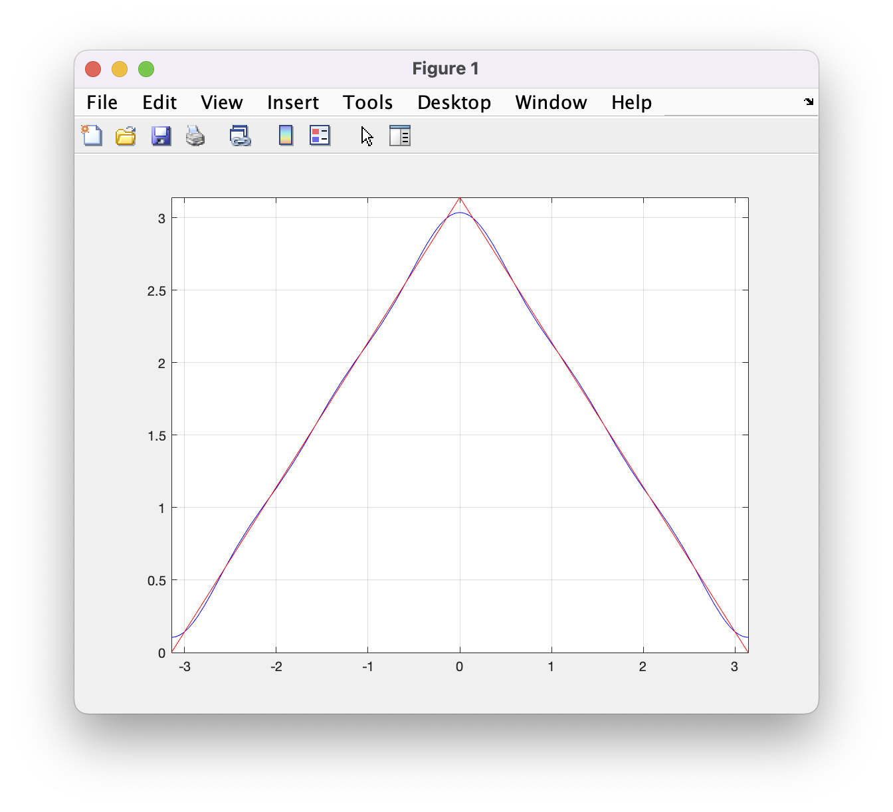

# Custom Fourier Series Function

Although MATLAB as a built-in Fourier Series function, it has a few disadvantages such it only computes for a single legged function and only goes till the order of 8.

The custom function made here can go to any order n based on user input, and can plot both single and multi-legged function. There are one small consideration that, all function inputs must be given as an array input, both for single legged and multi-legged functions.

The code plots both the Fourier Series and the input function to a figure for comparison. Larger the Fourier Series order, the longer the computation.

The code comments have a detailed explanation of both the Maths and the logic.

The two sections below shows example usages for these functions.
# Usage from Command Window

```MATLAB
syms t; %a symbolic variable
f = [t + pi, pi - t]; %array containing one or more functions
flim=[-pi, 0, +pi]; %function limits
N = 5; %Fourier series order
[a0, an, bn, fs] = fourierSeries(f,flim,N) %call function and plot Fourier Series for visualisation
```
# Usage from MATLAB Script

```MATLAB
syms t;
f = [t + pi, pi - t];
flim=[-pi, 0, +pi];
N = 5;
fourierSeries(f,flim,N)
```
# Example Plot


